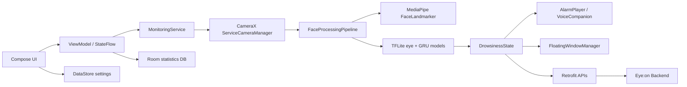

# Eye:on Android

Eye:on Android는 전면 카메라와 온디바이스 AI 모델을 이용해 사용자의 졸음과 수면 상태를 실시간으로 감지하고, 경고음, 플로팅 아이콘, 세션 통계, AI 동승자 대화를 제공하는 Android 클라이언트입니다.

이 저장소는 Eye:on 서비스의 모바일 앱 영역입니다. 백엔드 API와 연동해 인증, 모니터링 세션, 졸음 이벤트, AI 동승자 기능을 처리하며, 오프라인에서도 로컬 Room DB에 세션 통계를 남깁니다.

## 주요 기능

| 영역 | 기능 |
| --- | --- |
| 실시간 모니터링 | CameraX 전면 카메라 프레임 분석, MediaPipe Face Landmarker, TFLite eye/GRU 모델 추론 |
| 졸음 판정 | `NORMAL`, `DROWSY`, `SLEEPING` 3단계 상태 분류 |
| 경고 | 1단계 졸음 경고, 2단계 수면 경고, 사용자 해제, 단계별 알림음/음량 설정 |
| 백그라운드 동작 | Foreground Service 기반 카메라 유지, Android overlay 플로팅 아이콘 표시 |
| 서버 연동 | 로그인, 회원가입, 토큰 갱신, 모니터링 세션 시작/이벤트/종료, AI 동승자 API |
| 로컬 저장 | EncryptedSharedPreferences 토큰 저장, DataStore 설정 저장, Room 통계 저장 |
| 통계 | 세션 시간, 감지 횟수, 이벤트 타임라인, 배터리 사용량 기록 |
| 구독 | Free/Plus 요금제 UI와 로컬 mock 상태 관리 |

## 아키텍처 요약



핵심 런타임은 `MonitoringService`입니다. 서비스가 카메라 프레임을 받고, `FaceProcessingPipeline`이 MediaPipe와 TFLite 모델 추론을 수행한 뒤 결과를 UI, 알림, 플로팅 아이콘, 백엔드 API, 로컬 통계 저장소로 전달합니다.

## 기술 스택

| Category | Stack |
| --- | --- |
| Language | Kotlin, Java 17 target |
| UI | Jetpack Compose, Material 3, Navigation Compose |
| Async | Kotlin Coroutines, Flow, StateFlow |
| DI | Hilt |
| Camera | CameraX |
| Vision | MediaPipe Tasks Vision |
| ML Runtime | TensorFlow Lite |
| Local Storage | Room, DataStore Preferences, EncryptedSharedPreferences |
| Network | Retrofit, Gson converter, OkHttp interceptor/authenticator |
| Android Runtime | Foreground Service, Overlay Window, TextToSpeech, Speech Recognizer |

## 요구 사항

- Android Studio 최신 안정 버전
- JDK 17 이상
- Android Gradle Plugin 8.9.0
- Kotlin 2.1.21
- Android SDK
  - `compileSdk`: 35
  - `targetSdk`: 35
  - `minSdk`: 26
- 테스트 권장 환경
  - 전면 카메라가 있는 Android 8.0 이상 실기기
  - 카메라, 마이크, 다른 앱 위에 표시 권한 허용

에뮬레이터에서도 빌드는 가능하지만 카메라, 오버레이, 백그라운드 동작 검증은 실기기를 권장합니다.

## 빠른 시작

```bash
cd android
./gradlew :app:compileDebugKotlin
./gradlew :app:assembleDebug
```

Android Studio에서 실행하려면 `android` 디렉터리를 프로젝트로 열고 Gradle Sync 후 `app` 구성을 실행합니다.

첫 실행 시 필요한 권한:

- `CAMERA`: 실시간 얼굴/눈 분석
- `SYSTEM_ALERT_WINDOW`: 백그라운드 플로팅 아이콘
- `RECORD_AUDIO`: AI 동승자에게 음성 답변 입력
- `INTERNET`: 백엔드 API 연동

## 백엔드 연결

현재 앱의 API 기본 주소는 코드에 상수로 정의되어 있습니다.

```kotlin
// app/src/main/java/ac/sbmax002/eye_on/network/NetworkConfig.kt
const val BASE_URL = "https://api.eyeon.company"
```

로컬 백엔드와 연결할 때는 환경에 맞게 변경합니다.

| 환경 | 예시 |
| --- | --- |
| Android Emulator에서 호스트 PC 백엔드 접근 | `http://10.0.2.2:8080` |
| 실기기에서 같은 Wi-Fi의 개발 PC 접근 | `http://{개발PC_IP}:8080` |
| 운영 서버 | `https://api.eyeon.company` |

`AndroidManifest.xml`에는 개발 편의를 위해 `android:usesCleartextTraffic="true"`가 설정되어 있습니다.

## 프로젝트 구조

```text
android/
  app/src/main/
    AndroidManifest.xml
    assets/
      face_landmarker.task
      eye.tflite
      gru_fp32.tflite
    java/ac/sbmax002/eye_on/
      camera/          # CameraX preview/image analysis
      database/        # Room database, DAO, Hilt module
      model/
        inference/     # TFLite interpreter wrapper
        pipeline/      # MediaPipe/TFLite temporal detection pipeline
        statistics/    # Room entities and statistics state
        subscription/  # subscription model
        vision/        # MediaPipe FaceLandmarker wrapper
      navigation/      # Compose NavHost and routes
      network/         # Retrofit API interfaces and DTOs
      repository/      # auth/settings/statistics/subscription repositories
      service/         # foreground monitoring, overlay, alarm, TTS
      ui/              # Compose screens
```

## API 연동 범위

앱에서 사용하는 API는 다음과 같습니다.

| Domain | Endpoint |
| --- | --- |
| Auth | `POST /api/auth/login`, `POST /api/auth/signup`, `POST /api/auth/refresh`, `POST /api/auth/logout`, `DELETE /api/auth/account` |
| Monitoring | `POST /api/monitoring/sessions/start`, `POST /api/monitoring/sessions/{sessionId}/events`, `POST /api/monitoring/sessions/{sessionId}/end` |
| Agent | `GET /api/agent/config`, `POST /api/agent/chat` |

공통 헤더는 `NetworkConfig`에서 자동으로 추가됩니다.

```http
Accept: application/json
Content-Type: application/json
X-Client-Type: APP
Authorization: Bearer <accessToken>
```

401 응답이 오면 OkHttp `Authenticator`가 저장된 refresh token으로 `/api/auth/refresh`를 호출하고 원 요청을 한 번 재시도합니다.

## 문서

상세 문서는 `wiki` 디렉터리에 정리되어 있습니다.

| 문서 | 내용 |
| --- | --- |
| [Home](wiki/Home.md) | Wiki 목차와 읽는 순서 |
| [Project Overview](wiki/Project-Overview.md) | 프로젝트 목적, 기능, 사용자 흐름 |
| [Installation And Environment](wiki/Installation-And-Environment.md) | 설치 환경, 라이브러리, 실행 설정 |
| [Android Architecture](wiki/Android-Architecture.md) | 패키지 구조, 런타임 흐름, 데이터 저장 |
| [API Reference](wiki/API-Reference.md) | 앱 기준 API 요청/응답 계약 |
| [Usage Examples](wiki/Usage-Examples.md) | Kotlin 예제 코드와 확장 패턴 |

## 현재 구현 상태

| 항목 | 상태 |
| --- | --- |
| 로그인/회원가입/토큰 저장 | 구현 |
| 모니터링 세션 시작/이벤트/종료 API | 구현 |
| CameraX + MediaPipe 얼굴 랜드마크 | 구현 |
| TFLite eye/GRU 기반 temporal 졸음 판정 | 구현 |
| 플로팅 아이콘/Foreground Service | 구현 |
| 알림음/음량/아이콘 설정 | 구현 |
| 통계 Room 저장/조회 | 구현 |
| AI 동승자 TTS/음성 입력/API 호출 | 구현 |

## 개발 참고

- 앱 ID와 패키지명은 `ac.sbmax002.eye_on`입니다.
- 모델 파일은 `app/src/main/assets`에 포함되어 있어 별도 다운로드가 필요하지 않습니다.
- Room DB 이름은 `eye_on_database`입니다.
- 인증 토큰은 `EncryptedSharedPreferences`의 `auth_prefs`에 저장됩니다.
- 설정은 DataStore `settings`, 구독 mock 상태는 DataStore `subscription`에 저장됩니다.
- 서버 세션 ID는 백엔드에서 받은 `Long` ID이고, 로컬 통계 세션 ID는 앱이 생성한 UUID 문자열입니다.

## 품질 확인

```bash
cd android
./gradlew test
./gradlew connectedAndroidTest
./gradlew :app:compileDebugKotlin
./gradlew :app:assembleDebug
```

실기기 검증 체크리스트:

- 카메라 권한 허용 후 프리뷰 표시
- 모니터링 시작 시 앱이 백그라운드로 이동하고 foreground notification 표시
- 다른 앱 위에 플로팅 아이콘 표시
- 졸음/수면 상태에서 1단계/2단계 경고 동작
- 플로팅 아이콘 탭 또는 홈 화면 버튼으로 알림 해제
- 종료 후 통계 화면에 세션과 이벤트 저장

## 향후 개선

- `BASE_URL`을 build flavor 또는 `BuildConfig` 기반으로 분리
- 서버 DTO와 Android DTO의 nullable/default 정책 정리
- Room destructive migration 제거 및 명시적 migration 추가
- UI 테스트와 pipeline 단위 테스트 확대
