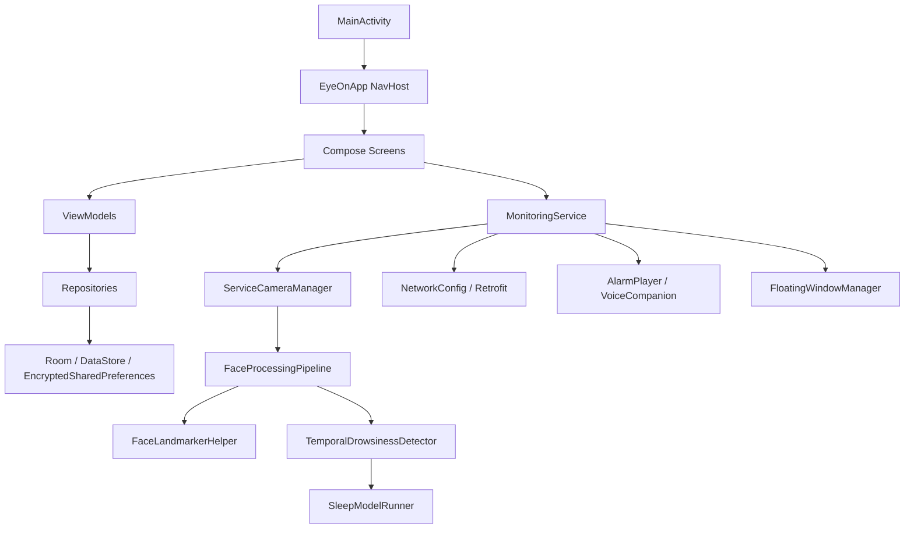
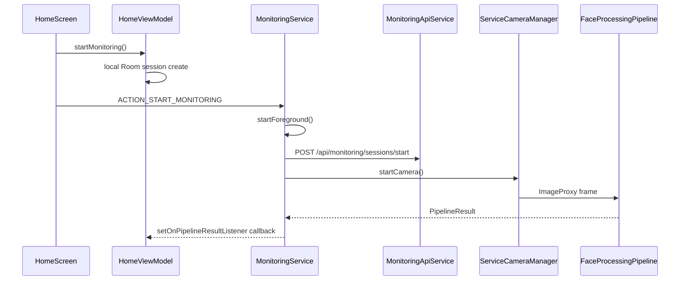
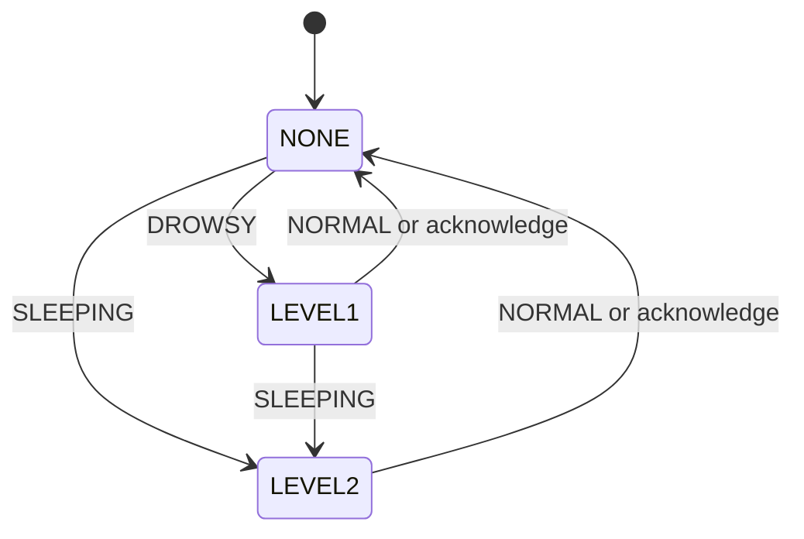

# Android Architecture

## 전체 구조

Eye:on Android는 MVVM 기반 Compose 앱이며, 모니터링 기능은 Foreground Service 중심으로 동작합니다.



## 패키지 역할

| Package | 역할 |
| --- | --- |
| `camera` | CameraX preview, image analysis, service camera lifecycle |
| `database` | Room database, DAO, Hilt provider |
| `model.inference` | TensorFlow Lite model runner |
| `model.pipeline` | face landmark, eye probability, temporal feature, state classification |
| `model.statistics` | Room entity, 통계 UI state, 배터리 추적 |
| `model.subscription` | 구독 tier/status model |
| `model.vision` | MediaPipe Face Landmarker wrapper |
| `navigation` | Compose route and NavHost |
| `network` | Retrofit service, DTO, common network config |
| `repository` | auth, settings, statistics, subscription state/data access |
| `service` | foreground monitoring, overlay, alarm, TTS |
| `ui` | Compose screens and ViewModels |

## 앱 시작 흐름

1. `EyeOnApplication.onCreate()`에서 `NetworkConfig.initialize()` 호출
2. `MainActivity`에서 Room DB, `StatisticsRepository`, `HomeViewModel`, `StatisticsViewModel` 생성
3. `AuthRepository`에서 저장된 token/userId 복원
4. token이 있으면 `home`, 없으면 `login`으로 시작
5. `MonitoringService`에 bind하여 camera preview와 pipeline result callback 연결

## 모니터링 시작 흐름



## 온디바이스 추론 파이프라인

`FaceProcessingPipeline`은 `FaceLandmarkerHelper`의 결과를 받아 `TemporalDrowsinessDetector`로 넘깁니다.

### 1. 입력 프레임

- CameraX `ImageAnalysis`
- RGBA_8888 output format
- front camera mirror transform
- Service mode에서는 `ServiceCameraManager`가 Activity lifecycle과 독립적으로 동작

### 2. 얼굴 랜드마크

- `face_landmarker.task`
- `RunningMode.LIVE_STREAM`
- `maxNumFaces = 1`
- detection/tracking/presence confidence 기본값 `0.5`

### 3. Feature 구성

`TemporalDrowsinessDetector`는 다음 feature를 구성합니다.

| Feature | 설명 |
| --- | --- |
| EAR z-score | 사용자 calibration 기반 눈 비율 |
| pClosed | eye TFLite 모델의 눈 감김 확률 |
| MAR z-score | 입 벌림 비율 |
| head pose z-score | pitch, yaw, roll |
| current closed duration | 현재 눈 감김 지속 시간 |
| PERCLOS | rolling window 내 눈 감김 비율 |
| blink duration/amplitude/velocity | 깜빡임 이벤트 통계 |
| blink rate | rolling window 내 blink 빈도 |
| time since last blink | 마지막 blink 이후 시간 |

`SleepModelRunner.FEATURE_COUNT`는 `13`입니다.

### 4. Temporal config

| 설정 | 기본값 | 의미 |
| --- | --- | --- |
| `targetFps` | `15` | 모델 feature row 생성 기준 FPS |
| `calibrationSeconds` | `8` | 사용자 baseline 학습 시간 |
| `sequenceSeconds` | `10` | GRU 입력 window |
| `gruIntervalMs` | `1000` | GRU 추론 주기 |
| `drowsyThreshold` | `0.5` | DROWSY 후보 확률 기준 |
| `sleepyThreshold` | `0.5` | SLEEPING 후보 확률 기준 |
| `resultSmoothingWindow` | `3` | 최근 예측 평균 window |
| `openEyeRecoveryMs` | `2000` | 눈 뜬 상태 유지 시 NORMAL 복귀 시간 |

### 5. 출력 상태

```kotlin
enum class DrowsinessState {
    NORMAL,
    DROWSY,
    SLEEPING
}
```

이 상태는 다음 모듈로 전달됩니다.

- `HomeViewModel`: UI 상태 및 Room event 저장
- `FloatingWindowManager`: 아이콘 색상/눈 모양 갱신
- `AlarmPlayer`: 단계별 경고음 재생
- `VoiceCompanion`: AI 음성 prompt 출력
- `MonitoringApiService`: 서버 event 기록

## 알림 상태 전이



서버 이벤트 기록 규칙:

| 전이 | 서버 eventType |
| --- | --- |
| `NONE -> LEVEL1` | `DROWSY` |
| `NONE -> LEVEL2` | `SLEEP` |
| `LEVEL1 -> LEVEL2` | `SLEEP` |
| `LEVEL1/LEVEL2 -> NONE` | `NORMAL` |

## 로컬 통계 구조

### DrivingSession

| Field | 설명 |
| --- | --- |
| `id` | 앱이 생성한 UUID 문자열 |
| `dateStr`, `time` | 표시용 날짜/시간 |
| `durationMinutes`, `durationStr` | 세션 길이 |
| `level1Alerts`, `level2Alerts` | 단계별 감지 횟수 |
| `rawDateTime` | 정렬/계산용 `LocalDateTime` |
| `mode` | `DRIVING`, `STUDY`, `ORGANIZATION` |
| `startBatteryPercent`, `endBatteryPercent`, `batteryUsagePercent` | 배터리 사용량 |

### SessionEvent

| Field | 설명 |
| --- | --- |
| `eventId` | auto generated PK |
| `sessionId` | `DrivingSession.id` 외래키 |
| `time` | 이벤트 시각 |
| `message` | 이벤트 메시지 |
| `duration` | 졸음 episode 지속 시간 |
| `level` | 1 또는 2 |

## 저장소 계층

| Repository | 저장소 | 역할                       |
| --- | --- |--------------------------|
| `AuthRepository` | EncryptedSharedPreferences | token/userId 저장, 삭제      |
| `SettingsRepository` | DataStore `settings` | 알림음, 음량, 민감도, 아이콘 크기 저장  |
| `StatisticsRepository` | Room | 세션/이벤트 저장 및 조회           |
| `SubscriptionRepository` | DataStore `subscription` | 결제 도입 불가에 따른 구독 임시 상태 저장 |
| `AppStateRepository` | Memory StateFlow | 앱 모드와 현재 access token 공유 |

## 네트워크 계층

`NetworkConfig`가 Retrofit과 OkHttp client를 생성합니다.

- `Accept: application/json`
- `Content-Type: application/json`
- `X-Client-Type: APP`
- access token이 있으면 `Authorization: Bearer {token}`
- 401 응답 시 refresh token으로 `/api/auth/refresh` 호출 후 원 요청 재시도

## 현재 구현상 주의점

- `NetworkConfig.BASE_URL`이 상수라서 환경별 URL 전환은 수동 수정이 필요합니다.
- 설정의 `DrowsinessSensitivity`는 서비스 설정 스트림에 연결되어 있지만, 현재 temporal model 판정은 `TemporalDetectionConfig` 중심으로 동작합니다.
- Room은 destructive migration을 사용합니다. 배포 버전에서는 migration을 명시해야 합니다.

