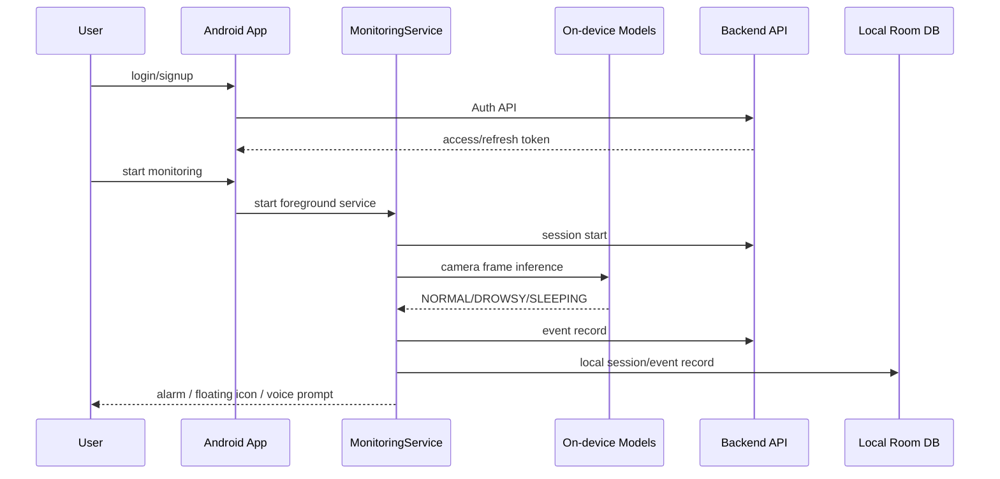

# Eye:on Android Wiki

이 위키는 Eye:on Android 앱을 처음 보는 개발자가 프로젝트 목적, 실행 환경, 아키텍처, API 연동 방식, 예제 코드를 빠르게 이해하고 바로 활용할 수 있도록 작성한 문서입니다.

## Pages

| Page | Description |
| --- | --- |
| [Project Overview](Project-Overview.md) | 프로젝트 개요, 사용자 흐름, 핵심 기능 |
| [Installation And Environment](Installation-And-Environment.md) | 설치 환경, 라이브러리, 로컬 실행, 권한 |
| [Android Architecture](Android-Architecture.md) | 패키지 구조, 모니터링 런타임, 데이터 저장 구조 |
| [API Reference](API-Reference.md) | Android 앱이 사용하는 API 계약, DTO, 인증 처리 |
| [Usage Examples](Usage-Examples.md) | Kotlin 예제 코드와 기능 확장 패턴 |

## Recommended Reading Order

1. 프로젝트를 이해하려면 [Project Overview](Project-Overview.md)를 먼저 읽습니다.
2. 로컬에서 실행하려면 [Installation And Environment](Installation-And-Environment.md)를 봅니다.
3. 코드를 수정하거나 기능을 확장하려면 [Android Architecture](Android-Architecture.md)를 확인합니다.
4. 백엔드와 연동하려면 [API Reference](API-Reference.md)를 기준으로 요청/응답 계약을 확인합니다.
5. 실제 구현에 바로 적용하려면 [Usage Examples](Usage-Examples.md)의 Kotlin 예제를 참고합니다.

## Service Summary

Eye:on Android는 운전, 학습, 조직 모니터링 상황에서 사용자의 졸음 상태를 실시간으로 감지하는 모바일 클라이언트입니다. 전면 카메라 프레임을 CameraX로 받고, MediaPipe Face Landmarker와 TensorFlow Lite 모델을 이용해 상태를 분류합니다. 감지 결과는 알림음, 플로팅 아이콘, 로컬 통계, 백엔드 모니터링 이벤트로 연결됩니다.

## Current Notes

- 이 Wiki는 `android` 디렉터리 단독 Android 프로젝트를 기준으로 작성되었습니다.
- 백엔드 Wiki는 `BE/wiki`, 관리자 웹 Wiki는 `FE/wiki`에 별도로 있습니다.
- Android 앱의 서버 기본 주소는 현재 `NetworkConfig.BASE_URL` 상수로 관리됩니다.
- 구독은 결제 시스템 도입 불가에 따른 임시 상태입니다.

