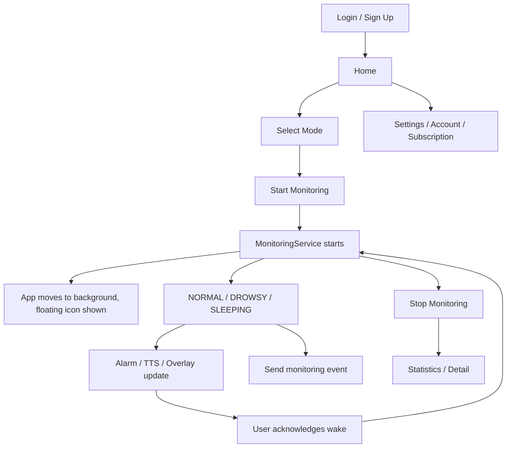

# Project Overview

## 프로젝트 개요

Eye:on Android는 카메라 기반 졸음 감지 모바일 앱입니다. 사용자가 모니터링을 시작하면 앱은 백그라운드에서도 전면 카메라 분석을 유지하고, 졸음 또는 수면 상태가 감지되면 경고음, TTS 음성, 플로팅 아이콘으로 즉시 알립니다.

앱은 단순히 화면에서 카메라를 보여주는 구조가 아니라 Foreground Service를 중심으로 동작합니다. 사용자가 다른 앱을 사용하거나 화면을 전환해도 모니터링이 유지되도록 설계되어 있습니다.

## 대상 사용자

| 사용자 | 사용 시나리오 |
| --- | --- |
| 일반 사용자 | 운전 중 졸음 감지, 개인 학습 중 집중 상태 확인 |
| 조직 소속 사용자 | 조직 관리자 웹과 연동되는 모니터링 세션/이벤트 전송 |
| 개발자 | Android 앱, 백엔드 API, 온디바이스 모델 파이프라인 확장 |

## 핵심 기능

### 실시간 졸음 감지

- CameraX `ImageAnalysis`로 전면 카메라 프레임 수집
- MediaPipe Face Landmarker로 얼굴 랜드마크 추출
- 눈 영역 crop 후 TFLite eye model로 눈 감김 확률 계산
- EAR, MAR, head pose, PERCLOS, blink feature를 temporal feature로 구성
- GRU TFLite 모델로 `NORMAL`, `DROWSY`, `SLEEPING` 분류

### 경고 및 사용자 피드백

- `DROWSY`: 1단계 졸음 경고
- `SLEEPING`: 2단계 수면 경고
- 경고음은 사용자가 단계별로 선택 가능
- 플로팅 아이콘 색상과 눈 모양으로 상태 표시
- 사용자가 "깨어났어요" 동작을 수행하면 즉시 알림 중지

### 백그라운드 모니터링

- `MonitoringService`가 Foreground Service로 카메라와 모델 파이프라인 유지
- 앱이 백그라운드로 이동하면 overlay 플로팅 아이콘 표시
- 플로팅 아이콘을 탭하면 앱으로 복귀하고 현재 알림을 해제

### 통계 저장

- 로컬 Room DB에 세션과 이벤트 저장
- 세션 시작/종료 시간, 모드, 감지 횟수, 배터리 사용량 기록
- 통계 화면에서 주간/월간/전체 필터와 상세 타임라인 제공

### 서버 연동

- 인증: 로그인, 회원가입, refresh, logout, account delete
- 모니터링: session start, event record, session end
- AI 동승자: agent config, chat
- 공통 헤더와 token refresh retry는 `NetworkConfig`에서 처리

## 앱 모드

앱은 세 가지 모드를 지원합니다.

| Mode | 설명 |
| --- | --- |
| `DRIVING` | 운전 중 졸음 감지 |
| `STUDY` | 학습/집중 상황의 졸음 감지 |
| `ORGANIZATION` | 조직 관리자 웹과 연동되는 모니터링 |

모드는 `AppStateRepository`의 `StateFlow<AppMode>`로 앱 전체에 공유됩니다.

## 사용자 흐름

## 현재 구현 상태

| 기능 | 상태 | 비고                               |
| --- | --- |----------------------------------|
| Compose 기반 로그인/회원가입 | 구현 | 백엔드 Auth API 호출                  |
| 토큰 보관 | 구현 | EncryptedSharedPreferences       |
| 자동 토큰 갱신 | 구현 | OkHttp Authenticator             |
| 실시간 카메라 분석 | 구현 | CameraX foreground service       |
| MediaPipe 얼굴 랜드마크 | 구현 | `face_landmarker.task`           |
| TFLite eye/GRU 추론 | 구현 | `eye.tflite`, `gru_fp32.tflite`  |
| 플로팅 아이콘 | 구현 | `SYSTEM_ALERT_WINDOW` 필요         |
| 알림음 설정 | 구현 | DataStore                        |
| 통계 저장 | 구현 | Room DB                          |
| AI 동승자 | 구현 | SpeechRecognizer, TTS, Agent API |
| 구독 결제 | 부분 구현 | 결제 시스템 도입 불가에 따른 임시 데이터          |

## 주요 파일

| 파일 | 역할 |
| --- | --- |
| `MainActivity.kt` | 앱 엔트리, 서비스 바인딩, 시작 화면 결정 |
| `EyeOnApplication.kt` | Hilt 및 네트워크 초기화 |
| `MonitoringService.kt` | 모니터링 런타임의 중심 |
| `FaceProcessingPipeline.kt` | MediaPipe 결과를 temporal detector로 전달 |
| `TemporalDrowsinessDetector.kt` | feature 생성, GRU 추론, 상태 분류 |
| `SleepModelRunner.kt` | TFLite interpreter wrapper |
| `NetworkConfig.kt` | Retrofit, OkHttp, 공통 헤더, refresh retry |
| `StatisticsRepository.kt` | 로컬 세션/이벤트 저장 |
| `SettingsRepository.kt` | 알림음, 음량, 아이콘 크기 등 DataStore 저장 |

